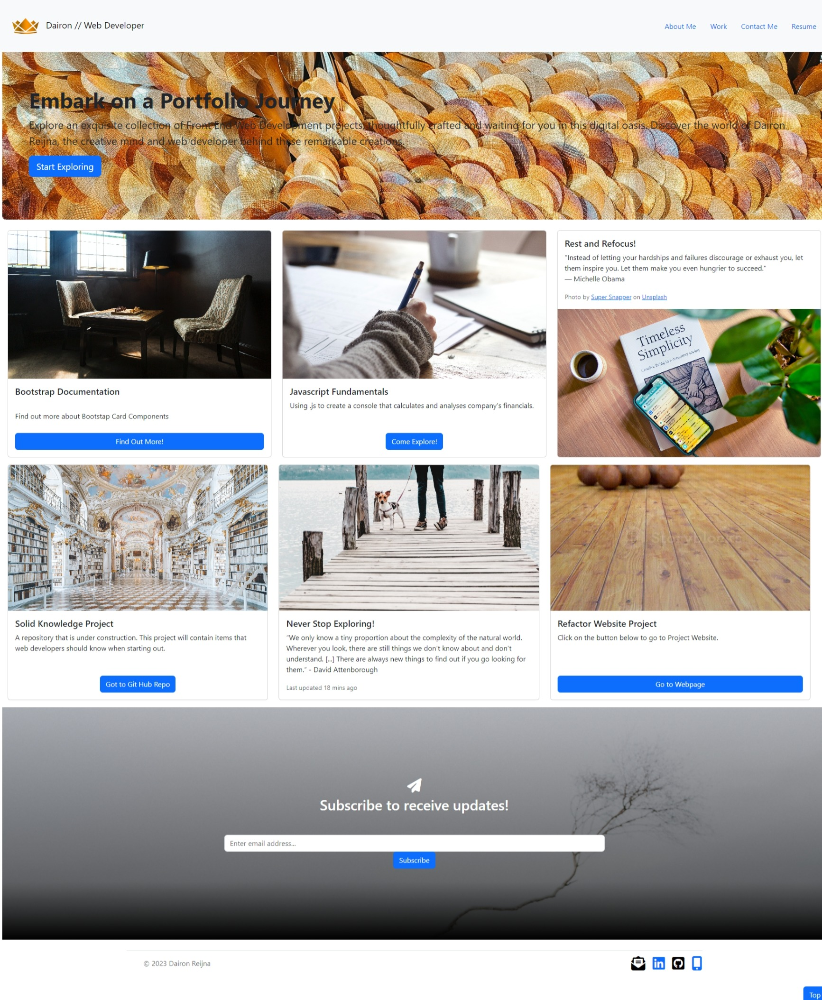

# Bootstrap Portfolio Project

Enhancing My Web Presence with a Professional Portfolio

## Table of Contents

- [Description](#description)
- [Motivation](#motivation)
- [Problem Solving](#problem-solving)
- [Learning Experience](#learning-experience)
- [Standout Features](#standout-features)
- [List of Actions](#list-of-actions)
- [Installation](#installation)
- [Usage](#usage)
- [Contributing](#contributing)
- [License](#license)

## Description

The Bootstrap Portfolio Project is a testament to my commitment to excellence, going beyond the confines of a mere project assignment. This project showcases not only my technical prowess but also my dedication to professional standards and exceptional user experience.

## Motivation

I embarked on the Bootstrap Portfolio Project with a clear motivation: to elevate my web development skills and present a portfolio that transcends expectations. My drive was fueled by a desire to demonstrate proficiency in utilizing Bootstrap to create a sophisticated and responsive portfolio. This project aids my journey towards becoming a proficient and sought-after web developer.

## Problem Solving

The Bootstrap Portfolio Project addresses the challenge of crafting an intuitive and engaging platform to showcase my work and skills. It offers an innovative solution by leveraging Bootstrap's framework to design a seamless and visually appealing portfolio. By incorporating user-centric design principles, I aimed to use this website to communicate my capabilities and accomplishments to potential employers and clients.

## Learning Experience

Throughout the development of the Bootstrap Portfolio, I underwent a transformative learning experience:

- **Strategic Iteration**: I adopted an iterative approach, making incremental changes and observing their impact. This methodology allowed me to troubleshoot issues, refine my design, and ensure a polished end product.

- **Commitment to Quality**: Regular commits were more than version control; they showcased my dedication to producing high-quality work and maintaining an active engagement in coding and learning.

- **Innovative Problem Solving**: Overcoming challenges, such as integrating elements seamlessly into a Bootstrap structure, honed my problem-solving skills and fueled my creativity.

## Standout Features

The Bootstrap Portfolio Project stands out for its synthesis of professionalism, accountability, and user-centric design:

- **Responsive Layout**: The portfolio seamlessly adapts to various screen sizes, ensuring a consistent and engaging user experience.

- **Clear Navigation**: Intuitive navigation guides users through the portfolio sections, enhancing accessibility and usability.

- **Engaging Interactions**: Hover effects and interactive elements create an engaging and memorable interaction for visitors.

## List of Actions
- Created a fluid layout with the Bootstrap 5 built-in col system.
- Built a desktop layout with three columns in Bootstrap using its built-in 12-column grid and user interface (UI) components.
- Customized the Bootstrap 5 template's UI components.
- Added
    - Containers and Rows  
    - Bootstrap Cards   
    - Bootstrap Forms and Modals  
    - Custom Webpage Navbar  
    - Custom Webpage Jumbotron 

## Installation

To explore the Bootstrap Portfolio Project locally, follow these steps:

1. Visit this repository - https://github.com/daironreijna/Bootstrap-Portfolio 
2. Clone the repository to your computer.
3. Open the `index.html` file in your preferred web browser.

## Usage

Explore the portfolio to gain insights into my skills, projects, and journey as a web developer. Here's a glimpse of the previous portfolio:

[Responsive Portfolio Website](https://daironreijna.github.io/Responsive-Portfolio/)

## Contributing
I welcome contributions from the community to enhance the Bootstrap Portfolio Project. By participating in this project, you contribute to a vibrant and inclusive environment. To ensure a positive experience the code of conduct we will adhere to is based on [The Contributor Covenant](https://www.contributor-covenant.org/version/2/1/code_of_conduct/code_of_conduct.md). Please review and follow these guidelines when contributing. 

## Resources

- Collaborators: none
- Third-party Assets: none
- Tutorials: https://fantastic-pudding.vercel.app/03-ux-bootstrap-module/
- https://tinypng.com/
- Creating a Modal Image Gallery With Bootstrap Components https://css-tricks.com/creating-a-modal-image-gallery-with-bootstrap-components/
- Halfmoon: A Bootstrap Alternative with Dark Mode Built In - https://css-tricks.com/halfmoon-a-bootstrap-alternative-with-dark-mode-built-in/
- https://css-tricks.com/a-complete-beginners-guide-to-npm/
- https://css-tricks.com/dialog-components-roll-your-own/
- https://css-tricks.com/css-cascade-layers/
- https://webdesign.tutsplus.com/how-to-use-figmas-inspect-panel--cms-36323t
- https://www.youtube.com/watch?v=B242nuM3y2s
- https://www.w3schools.com/icons/fontawesome_icons_intro.asp
- https://mui.com/material-ui/
- https://m3.material.io/
- https://www.youtube.com/materialdesign
- [A Designer Who Codes (2023) Vertically Aligned Bootstrap Cards (and it's responsive too!)](https://youtu.be/jxrHcG61h2Y)
 

## License

This project is licensed under the [MIT License](./LICENSE).

---

© 2023 Dairon Reijna. Confidential and Proprietary. All Rights Reserved.
